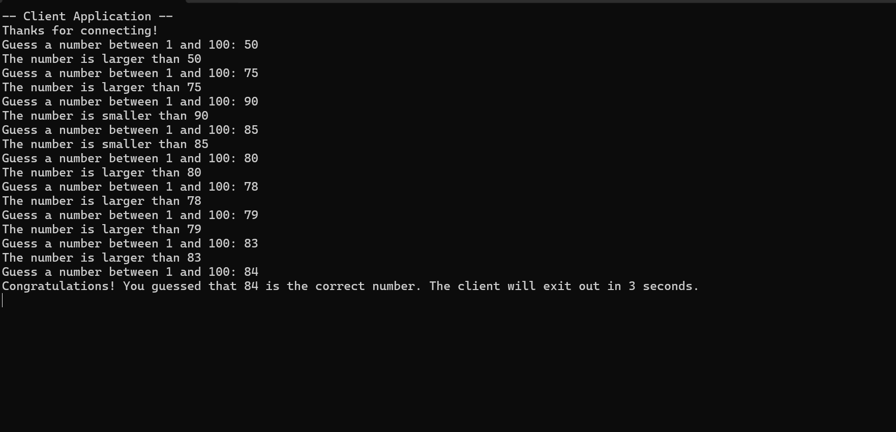

# Networking-Game




A simple client-server number guessing game demonstrating socket programming. The server generates a random number, and the client tries to guess it.

This is a number guessing game where:

• The server generates a random number between 1 and 100

• The client connects to the server and attempts to guess the number

• The server provides feedback if the guess is too high or too low

• Once the correct number is guessed, the client application closes after 3 seconds


# Tools Used

• VSCode - Code editor

• Python 3.x - Programming language

# Dependencies

• Python 3.x

• Standard libraries (socket, random, time) - No external packages required

# Installation & Running

1. Clone or download this repository

2. Open a terminal/command prompt

3. Navigate to the project directory

4. Run the server first:

  ```python Assignment4Server.py```

5. In a separate terminal window, run the client:

  ```python Assignment4Client.py```

6. Follow the prompts in the client application to play the game

# How to Play

1. After starting the client, you'll be prompted to guess a number between 1 and 100

2. Enter your guess and press Enter

3. The server will tell you if your guess is too high, too low, or correct

4. Continue guessing until you find the correct number

5. The client will automatically close 3 seconds after a correct guess

# Code Overview

Server (Assignment4Server.py)

The server creates a socket connection, listens for a client, generates a random number, and provides feedback on the client's guesses.

Client (Assignment4Client.py)

The client connects to the server, sends guesses to the server, and displays the server's feedback until the correct number is guessed.

# Network Details

Protocol: TCP

Host: localhost (127.0.0.1)

Port: 12345


